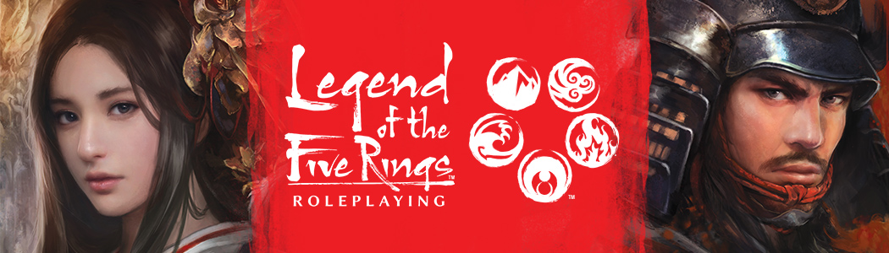

# Legend of the Five Rings (5th Edition) by [Edge Studio](https://edge-studio.net/)

# English

This is a game system for [Foundry Virtual Tabletop](https://foundryvtt.com/) provides a character sheet and basic systems to play [Edge Studio's](https://edge-studio.net/) Legend of the Five Rings 5th edition.
This version is authorized by Edge Studio, all texts, images and copyrights are the property of their respective owners.

## Install with the manifest
1. Copy this link and use it in Foundry system manager to install the system.
> https://gitlab.com/teaml5r/l5r5e/-/raw/master/system/system.json

### Recommended modules
- Dice so Nice, for 3D dices : https://gitlab.com/riccisi/foundryvtt-dice-so-nice
- Search Anywhere : https://gitlab.com/riccisi/foundryvtt-search-anywhere (don't spent too much time searching the right technique)

## Current L5R team (alphabetical order)
- Carter (compendiums, adventure adaptation)
- Hrunh (compendiums, pre-gen characters adaptation)
- Mandar (development)
- Sasmira (contributor)
- Vlyan (development)

## Remerciements, vielen danke & Many thanks to :
1. José Ladislao Lainez Ortega, aka "L4D15", for his first version
2. Sasmira and LeRatierBretonnien for their work on the [Francophone community of Foundry](https://discord.gg/pPSDNJk)
3. Flex for his advice

## Contribute
You are free to contribute and propose corrections, modifications after fork. Try to respect 3 rules:
1. Make sure you are up to date with the referent branch.
2. Clear and precise commit messages allow a quick review of the code.
3. If possible, limit yourself to one Feature per Merge request so as not to block the process.

# French

Il s'agit d'un système de jeu pour [Foundry Virtual Tabletop](https://foundryvtt.com/) qui fournit une fiche de personnage et des systèmes de base pour jouer à La Légende des Cinq Anneaux 5e édition de [Edge Studio](https://edge-studio.net/).
Cette version est autorisée par Edge Studio, tous les textes, images et droits d'auteur reviennent à leurs propriétaires respectifs.

## Installer avec le manifeste
Copier ce lien et chargez-le dans le menu système de Foundry.
> https://gitlab.com/teaml5r/l5r5e/-/raw/master/system/system.json

### Modules requis pour le français
Pour traduire les éléments de base de FoundryVTT (interface), il vous faut installer et activer le module suivant :
> https://gitlab.com/baktov.sugar/foundryvtt-lang-fr-fr

La traduction du système fonctionne directement, cependant les compendiums nécessitent d'installer et activer le module Babele pour être traduit :
> https://gitlab.com/riccisi/foundryvtt-babele

### Modules recommandés
- Dice so Nice, pour avoir des dés 3D : https://gitlab.com/riccisi/foundryvtt-dice-so-nice
- Search Anywhere : https://gitlab.com/riccisi/foundryvtt-search-anywhere (pour ne pas perdre top de temps à chercher une technique)

## Nous rejoindre
1. Vous pouvez retrouver toutes les mises à jour en français pour FoundryVTT sur le discord officiel francophone
2. Lien vers [Discord Francophone](https://discord.gg/pPSDNJk)

## L'équipe L5R actuelle (par ordre alphabétique)
- Carter (compendiums, adaptation de scénario)
- Hrunh (compendiums, adaptation des pré-tirés)
- Mandar (développement)
- Sasmira (contributeur)
- Vlyan (développement)

## Remerciements, vielen danke & Many thanks to :
1. José Ladislao Lainez Ortega, aka "L4D15", pour sa première version
2. Sasmira et LeRatierBretonnien pour leur travail sur la [communauté Francophone de Foundry](https://discord.gg/pPSDNJk)
3. Flex pour ses conseils

## Contribuer
Vous êtes libre de contribuer et proposer après fork des corrections, modifications. Essayez de respecter 3 règles :
1. Assurez-vous de bien être à jour par rapport à la branche référente.
2. Des messages de commit clair et précis permettent une relecture rapide du code.
3. Limitez-vous si possible à une Feature par demande de Merge pour ne pas bloquer le processus.

Screens

